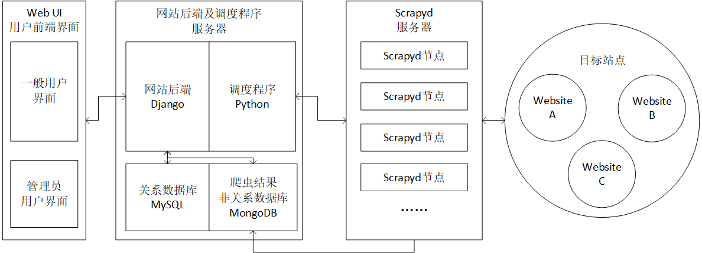

# 软件工程实验 2020H
## 基于Scrapy的模板化爬虫程序管理平台(EasySpider)

### 小组成员
[赵正阳](https://github.com/ZZy979)，
[郭浩隆](https://github.com/ghlfcb)，
[沈一聪](https://github.com/icessspark)，
[梁远志](https://github.com/tonnylyz)，
[宋冰晨](https://github.com/Ssynchronicity)

### 实验内容
- [x] 实验准备
- [x] 实验1：软件需求分析
- [x] 实验2：软件需求评审
- [x] 实验3：软件设计与实现
- [x] 实验4：软件测试需求分析
- [x] 实验5：软件测试评审
- [x] 实验6：软件项目计划与监控
- [x] 实验7：配置管理
- [x] 实验8：软件工程实验追踪与分析
- [ ] 实验总结

### 系统架构图

### 核心功能
* 内置多种包含主流网站数据源的模板，如京东、天猫、大众点评等热门采集网站，模板提供设置参数即采集的字段
* 管理采集任务，包括添加采集任务、查看采集的实时进度、启动采集、暂停采集、终止采集
* 管理采集结果，包括浏览采集结果、保存采集结果到本地
* 使用Scrapyd管理爬虫任务，实现分布式爬虫
* 使用Selenium实现应对反爬虫机制
* 使用统一的代理池实现应对反爬虫机制

### 代码仓库
https://github.com/easy-spider
